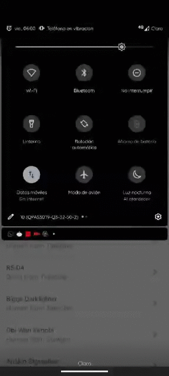

# Ravn-Challenge-V2-JuanFlores

## Star Wars Guide
Simple application to know about the characters of the star wars franchise.

### Setup/Running
It is recommended to use Android Studio with a 4.1 plugin at least, on a device with sdk 21 at least (Android LOLLIPOP).

### Preview

### Assumptions
- the application does not save data in storage

### Technologies used.
- Android Databinding
- Kotlin Coroutines
- Apollo client
